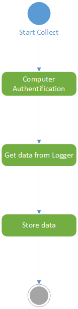

# Centralized server functional requirement specifications

## Introduction

This document describes the centralized server functional specifications. The server collects Logger's data and provide a secure access to this data for a Consumer.
For this, the server is composed by third main components :
- Collector API
- Consumer API
- Authentication API

## Use case

### Collector API

This API is WebService to collect, adjust and store data from an external Keylogger. If the kelogger has a valid computer token, it is authorize to send data.
Next, the Collector API prepares the data and stores  it in storage data.

The data of communication between the keylogger and the Collector API is defined [here](../Collected data format/collected data format.md).

### Consumer API

This API is WebService that provide an access to the stored data. If the consumer has a valid user token, it is authorize to send data.
The Consumer API add a filter condition to return only the user's data.

