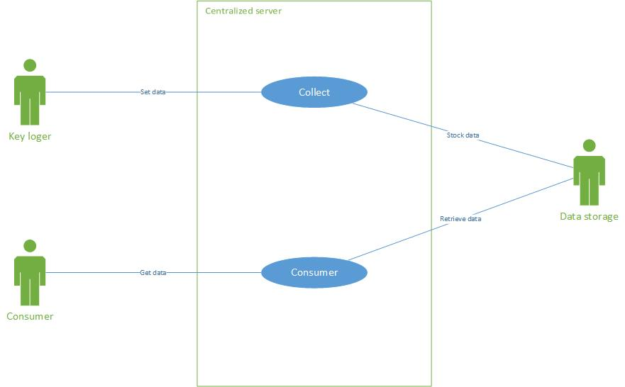

# Centralized server functional requirement specifications

## Introduction

This document describes the centralized server fonctionnal specifications.

## Use case

## Installation management

### Install

Comming Soon

### Collector API

This AP is WebService to  collect data from a collector and set data in the server system.

### Consumer API

This AP is WebService to access a storage data. To get data, you need to be identified and to subcribe on flux of data.
