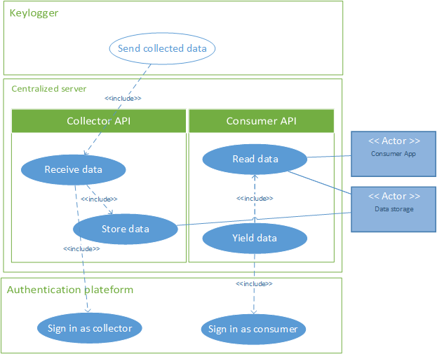
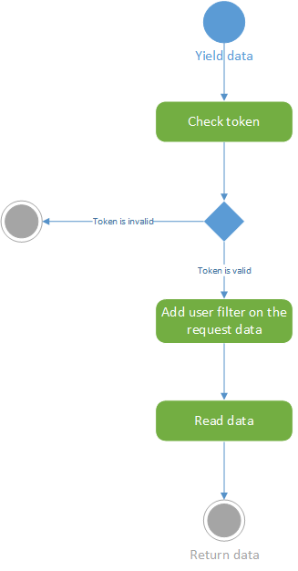

# Centralized server functional requirement specifications

## Introduction

This document describes the centralized server functional specifications.
The *Centralized server* collects logger data and provide a secure access to this data for a *Consumer* via APIs.
For this, the server has two main components:
- Collector API
- Consumer API

## Use case

### Collector API

The *Collector API* receive, adjust and store data from an external logger (a keylogger in this release : R1).

#### Receive data

The external logger sign in to the *Authentication platform* with a delegated identity data provider (client id and client secret). This delegated identity provides only access to collector APIs as a specific account and is provided by the *Account Manager* of the *Authentication platform*.
The *Collector APIs* checks the right of the delegated identity: it must have the right to record the data collected as the associated account.
It receives the collected data from the logger.
The data format used between the *Logger* and the *Collector API* is defined by the [collected data format](../Collected data format/collected data format.md).

#### Store data

### Consumer API

This API is WebService that provide an access to the stored data. If the consumer has a valid user token, it is authorize to send data.
The Consumer API add a filter condition to return only the user's data.

