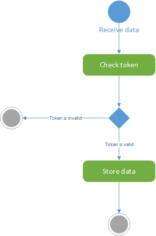

# Centralized server functional requirement specifications

## Introduction

This document describes the centralized server functional specifications. The server collects Logger's data and provide a secure access to this data for a Consumer.
For this, the server is composed by two main components, the collector and the consumer.

## Use case

## Installation management

### Install

Coming Soon  

### Collector API

This API is WebService to collect, adjust and store data from an external Logger.

### Consumer API

This AP is WebService to access a storage data. To get data, you need to be identified and to subscribe on flux of data.
