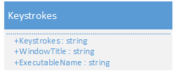

# Collected data specifications format

## Container

The container format encapsulates any collected data type.

## Collected data type

The container support any collected data type.
The collected data is recorded in *Data* field (see *Collected data type* class)

### Keystrokes

