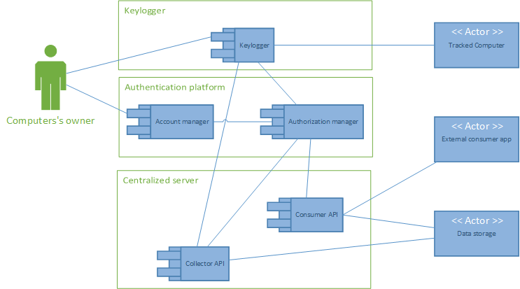

# Kal-El
## Introduction
The document describes the user requirement and functional specifications of Kal-El solution for the first release (R1).

To describe the requirements, UML2 diagrams and use stories are used.

### What is Kal-El ?
Kal-El is the project codename for the first release of an online keylogger application.

## Functional requirement specifications
### Short description

Kal-El is an online keylogger composed by a suite of applications:
* **Authentifier**: Authentification & authorization platform for collector and consumer applications. Provide an account manager.
* **Keylogger**: Keylogger application. Collect data and submit it to the server.
* **Centralized server**: Store collected data. Provide an API for collector and consumer applications.
* **Consumer**: Client consumer application. Provide an user interface to view collected data. This application WILL NOT be made in this release (R1).

### Use cases

Each application is describe into their own functional requirement specification wiki page (see below).

[Keylogger functional requirement specifications](Keylogger/Keylogger-functional-requirement-specifications.md)

[Centralized server functional requirement specifications](Centralized-Server/Centralized-server-functional-requirement-specifications.md)