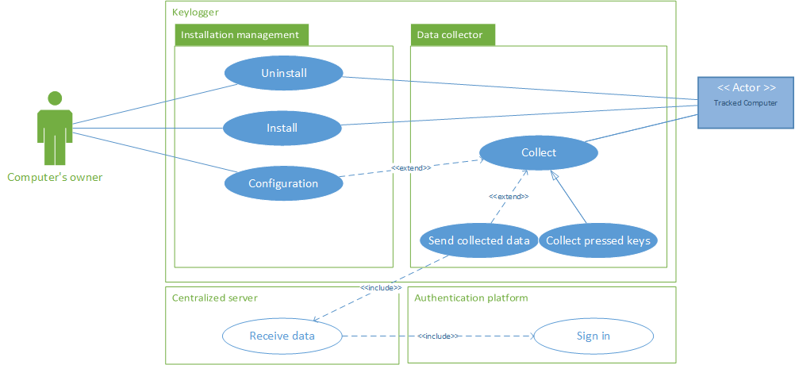
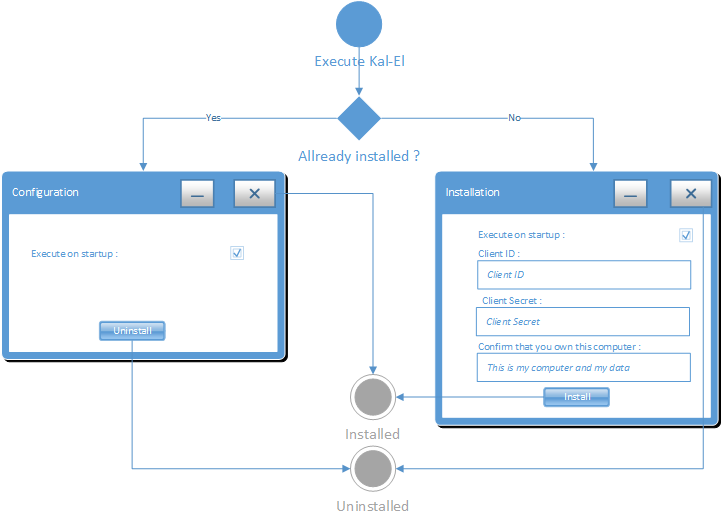
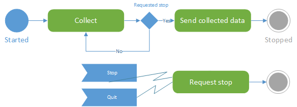
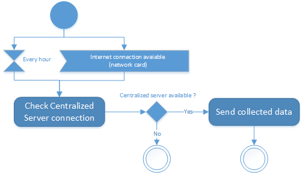

# Keylogger functional requirement specifications

## Introduction

This document describes the keylogger fonctionnal specifications.

## Use case

## Installation management

### Install

The *Computer's owner* get a delegated identity from the account manager (Centralized Server) then installs the keylogger on his computer with this identity and URL of the centralized server. Before installation, the computer owner must confirm that he is the owner of the computer and data by explicitly typing the sentence "This is my computer and my data".

During installation, the keylogger can be added to the startup of any window sessions.

After installation, the keylogger must be hidden, no window should be visible and the collect operation must start (see *Collect* use case).

### Uninstall

The *Computer's owner* can uninstall the keylogger by running the configuration manager (see *Configuration* use case) and selecting "Uninstall".
The keylogger stop its collect operation, remove to the startup and self uninstall.

### Configuration

The *Computer's owner* run the keylogger from the original binary or installation path, the keylogger configuration window appears. This windows also appears when `<Ctrl><Shift>KAL-EL</Shift><Ctrl>` is pressed.

In the configuration window, the *Computer's owner* can enable/disable the startup run and uninstall the keylogger (see *Uninstall* use case)

## Data collector

### Collect

The keylogger starts to collect after the installation and stop when asked to exit (uninstall, terminate process, windows shutdown).
The collected data are pressed keys (see *Collect pressed keys* use case) only in this release.

All locally stored data must be **encrypted**.

### Send collected data

The collected data must be send to centralized server every hour or on internet connection availability (if the internet connection was not available).

Collected data are send to centralized server with [collected data format](../Collected data format/collected data format.md).

### Collect keystroke

The keylogger must collect standard keystrokes :
* Typewriter keys: *A-Z a-z 0-9 /-|{} [Space] [Tab] [Enter]* etc.
* Function keys: *[F1] [F2]* etc.
* Others keys: *[Esc] [Del] [Home] [Pause] [Page Up]* etc.
* Cursor control keys: *[<] [^] [>] [v]*
* Dead key: *^¨* etc.
* Modifier keys (with state: pressed and release): *[Ctrl] some other keys [/Ctrl]* *[Alt] some other keys [/Alt]*
